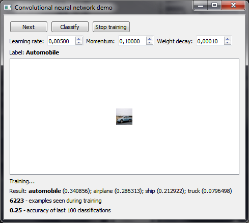

# ConvolutionalNeuralNetworkDemo
Demonstration of a working convolutional neural network using the CIFAR-10 dataset. Written in Qt/C++.
## Download
Download link: [Win32 binary](https://github.com/Extender/ConvolutionalNeuralNetworkDemo/raw/master/bin/convolutionalneuralnetworkdemo-v1.0-bin-win32.zip)
## Screenshot

